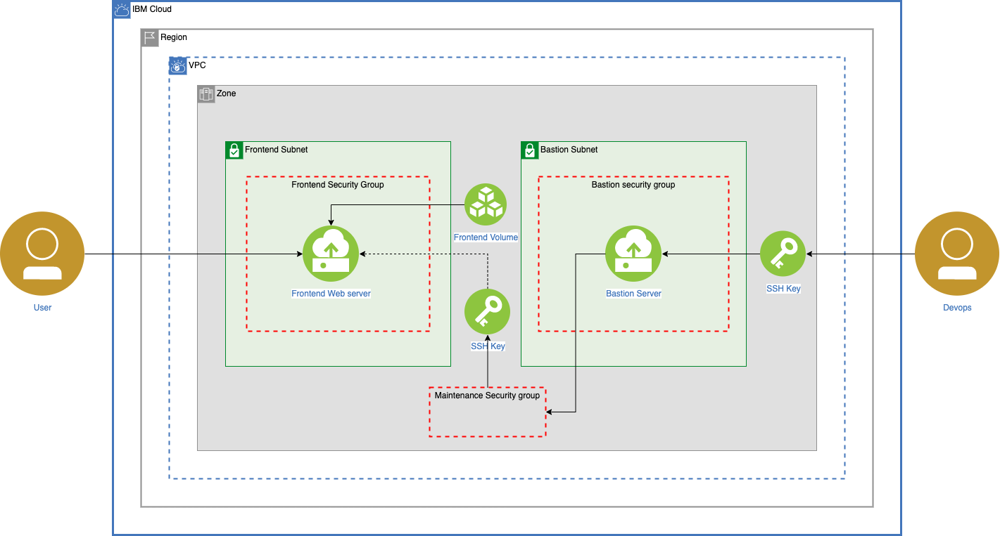

# terraform-vpc-db

This terraform template walks you through the deployment of a bastion host to securely access remote instance within a virtual private cloud. Bastion host is an instance that is provisioned with a public IP address and can be accessed via SSH. Once set up, the bastion host acts as a jump server allowing secure connection to instances provisioned without a public IP address.

To reduce exposure of servers within the VPC you will create and use a bastion host. Administrative tasks on the individual servers are going to be performed using SSH, proxied through the bastion. Access to the servers and regular internet access from the servers, e.g., for software installation, will only be allowed with a special maintenance security group attached to those servers.

## Securely manage servers via the bastion host

The figure here illustrates the configuration of the VPC deployed by
this example. For a detailed explanation of bastion host, ACL and
security group configuration, please see the IBM Developer article
[Secure VPC access with a bastion host and Terraform]().



1. After setting up the required infrastructure (subnets, security groups with rules, VSIs) on the cloud, the admin (DevOps) connects (SSH) to the bastion host using the private SSH key.
2. The admin assigns a maintenance security group with proper outbound rules.
3. The admin connects (SSH) securely to the instance's private IP address via the bastion host to install or update any required software eg., a web server
4. The internet user makes an HTTP/HTTPS request to the web server.

## Deployed resources

The following resources are deployed by this template and may incur
charges.

- 1 x Floating IP address
- 1 x Public Gateway
- 2 x VSIs
- 1 x VPC
- Access Control Lists
- Security Groups

## Usage with Redhat Ansible

Support for software installation and configuration with Redhat Ansible is enabled by the addition
of VSI tags. The Ansible group assignment of VSIs is determined by the setting of IBM Cloud resource
tags on the `ibm_is_instance` resource statements. Tags are prefixed with "ans_group:" followed by the group name.   '
`tags = ["ans_group:backend"]`. A VSI can be assigned to multiple groups, by the addition of multiple `ans_group:`
prefixed tags.

In this example VSI's are grouped by the Terraform module (frontend) used for deployment. This ensures the match between the VPC network configuration of a VSI and the Ansible role deployed on the VSI.

Correct specification of tags is essential for operation of the Ansible dynamic inventory
script used by Ansible to retrieve host information from the Terraform State file. The tags here should match the roles
defined in the mount.yml playbook file.

## Requirements


|  **Name**                         | **Version** |
|  ---------------------------------| -------------|
|  terraform                        |   ~> 0.12    |
|  terraform_provider_ibm           |   ~> 1.11.1  |
|  terraform_provisioner_ansible    |   ~> 2.3.3   |

*NOTE: After downloading the above `terraform_provider_ibm` and `terraform_provisioner_ansible` plugins, you should place them inside `~/.terraform.d/plugins` directory.


## Inputs

| name | description | type | required | default | sensitive |
| ---------- | -------- | -------------- | ---------- | ----------- | ----------- |
| ibmcloud_api_key | IBM Cloud API Key  | string | ✓ | | ✓ |
| region | IBMCloud Region that is to be targeted  | string | | "us-south" |   |
| ssh_key_name | Name given to public SSH key uploaded to IBM Cloud for VSI access |  string |  ✓   |    |    |  
| basename | basename  | string | | "mydb" |   |  
| vpc_name  | Unique VPC name     | string | | "mydb"   |   |
| zone | zone of the resources | string | | "us-south-1" |   |
| profile | Profile for VSI deployed in frontend and backend  | string  | | "cx2-2x4" |  |
| ibm_is_image_id | Image ID for Bastion and frontend VSIs| string | |"r006-931515d2-fcc3-11e9-896d-3baa2797200f" |   |
| backend_pgw | set to true if the backend should have a public gateway  | bool | | "true" |   |  
| maintenance | set to true for allowing ssh access from the bastion  | string | | "mydb" |   |  
| frontend_user_data | cloud-init script  | string | | "" |   |
| resource_group_name | Name of IBM Cloud Resource Group used for all VPC resources | string | | "Default" |  |  
| iops | IOPS for Block storage  | string | | "100" |   |  
| capacity | Capacity of the block storage  | string | | "200" |   |
| volume_profile | Profile of the Block storage  | custom | | "mydb" |   |
| ssh_private_key | Optional private key from key pair. Only required if it desired to validate remote SSH access to the bastion host and VSIs. | string  | ✓ | |  ✓   |


## Outputs

|  **name**      |    **description**  |
|  --------------------------------------- | ------------------------------------------- |
|  floating_ip_address | Floating IP address attached to the bastion |
|  security_group_id | Maintenance security group |
|  bastion_security_group_id | Bastion maintenance security group |

## Instructions

1.  Make sure that you have the [required IBM Cloud IAM
    permissions](https://cloud.ibm.com/docs/vpc?topic=vpc-managing-user-permissions-for-vpc-resources) to
    create and work with VPC infrastructure and you are [assigned the
    correct
    permissions](https://cloud.ibm.com/docs/schematics?topic=schematics-access) to
    create the workspace and deploy resources.
2.  [Generate an SSH
    key](https://cloud.ibm.com/docs/vpc?topic=vpc-ssh-keys).
    The SSH key is required to access the provisioned VPC virtual server
    instances via the bastion host. After you have created your SSH key,
    make sure to [upload this SSH key to your IBM Cloud
    account](https://cloud.ibm.com/docs/vpc-on-classic-vsi?topic=vpc-on-classic-vsi-managing-ssh-keys#managing-ssh-keys-with-ibm-cloud-console) in
    the VPC region and resource group where you want to deploy this
    example
3.  To run this example you need to execute:

    ```bash
    $ terraform init
    $ terraform plan
    $ terraform apply
    ```